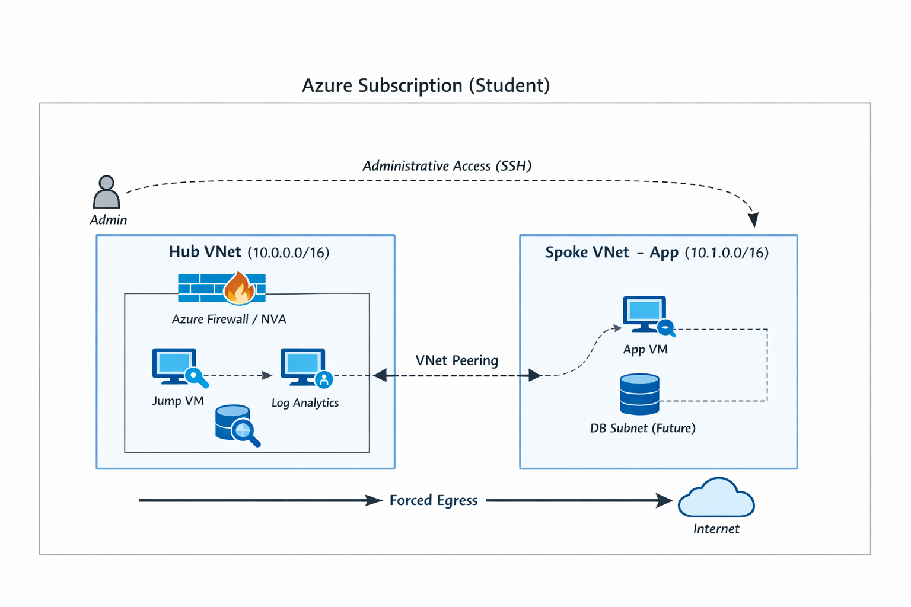
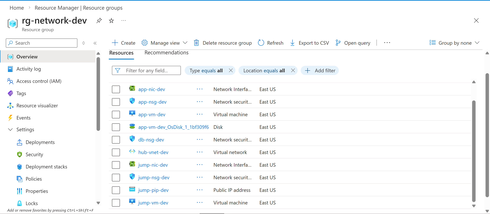

# Azure Secure Landing Zone (Terraform)

This project demonstrates a production-style Azure secure landing zone
implemented using Terraform under Azure Student subscription constraints.

## Objectives
- Implement a hub-and-spoke network architecture
- Enforce network-level security controls
- Centralize logging and monitoring
- Follow enterprise Terraform best practices

## Constraints
- Azure Student subscription
- No Owner / IAM permissions
- Focus on in-subscription security controls

## Architecture

The solution is based on a secure hub-and-spoke network architecture.

Detailed design decisions are documented in
[`architecture/architecture.md`](architecture/architecture.md).

## Terraform Foundation

This project uses a modular Terraform structure with environment isolation.

- `global/` contains provider and version configuration
- `environments/` defines per-environment orchestration
- `modules/` contains reusable infrastructure components

Local state is used to accommodate Azure Student subscription limitations.

## Network Security Layer

Network segmentation and traffic control are implemented using Network Security Groups (NSGs).

Three NSGs are deployed:

- **Jump NSG**
  - Allows SSH (port 22) for administrative access.

- **Application NSG**
  - Allows SSH traffic only from the Jump Subnet.

- **Database NSG**
  - Allows database traffic only from the App Subnet.

These rules enforce a **least-privilege network access model** and prevent direct access to internal workloads from the internet.

## Secure Compute Layer

Two Linux virtual machines are deployed to simulate a secure application environment.

### Jump Host (Hub VNet)

- Public IP enabled
- Used for administrative access
- SSH authentication with public key

### Application VM (Spoke VNet)

- No public IP address
- Accessible only through the Jump Host
- Located in a private subnet

This architecture prevents direct exposure of application workloads to the internet.

## Monitoring and Logging

Network activity is monitored using Azure Monitor and Log Analytics.

Diagnostic logs from Network Security Groups are sent to a centralized Log Analytics workspace.

This allows analysis of:

- Allowed network traffic
- Blocked connection attempts
- Source and destination IP addresses

## Deployed Infrastructure

The following screenshot shows the deployed Azure resources in the network resource group.

